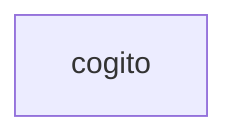

# cogito domain context

## Domain graph

<!-- cogito:generated:domain-graph:start -->

<!-- cogito:generated:domain-graph:end -->

## Notes

Cogito is the API-native workflow control plane. It resolves product
specifications, policies, gates, and capability boundaries into immutable
execution contracts for the worker. Repository-domain discovery is read-only;
any update to this document is proposed through a governed pull request.
