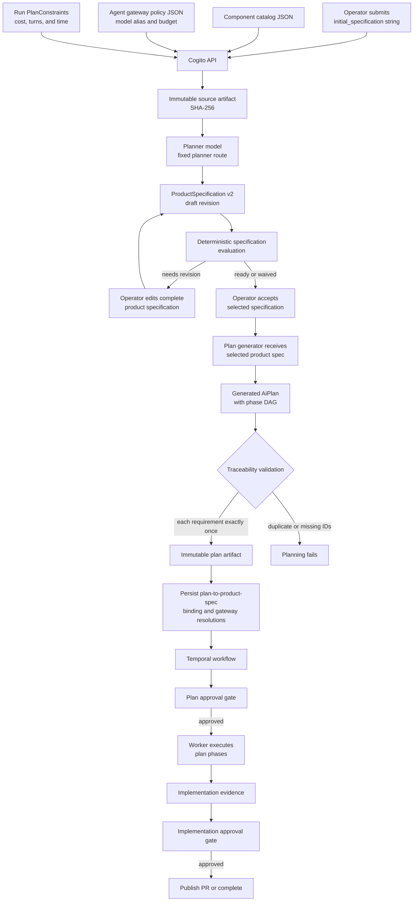
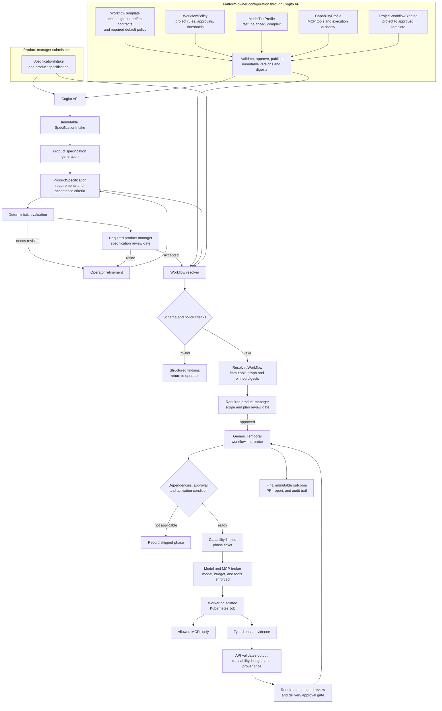

# Schema-driven workflow architecture

This document describes the proposed evolution from Cogito's current planning
flow to an API-native, schema-driven workflow control plane. It is a design
proposal; it does not grant an intake document, an agent, or a browser the
authority to change workflow policy or execution permissions.

## Design principles

- Product managers submit one product specification through Cogito's API and
  Workbench. They do not select a workflow policy, model, agent, MCP tool, or
  budget ceiling.
- Platform owners configure workflow templates and policies through Cogito's
  API and Workbench rather than through GitOps as the runtime control plane.
- Cogito's API, PostgreSQL, and Temporal remain the authorities for workflow
  configuration, durable state, approvals, and audit history.
- Kubernetes remains the execution substrate for workers, isolated jobs,
  ephemeral environments, resource limits, and network boundaries.
- Every published workflow template has one required default workflow policy.
  A project can run a template only when a platform-owned project binding
  selects it.
- Every published template declares non-bypassable product, plan, and delivery
  review gates. Policy may add gates, but cannot remove a template-required
  gate for an ordinary run.
- Every run executes an immutable, content-addressed resolved workflow; active
  runs do not silently change when an operator publishes a later configuration
  version.

## Current end-to-end flow



The current flow has valuable immutable artifacts and approval gates, but its
workflow configuration is fragmented. The initial specification is a string,
the generated plan becomes the effective phase graph, and model/capability
configuration lives separately from the per-run request.

## Target end-to-end flow



## Contract model

The platform should use separate versioned contracts. The product manager's
single specification is composed with platform-owned published contracts by
the resolver; it does not embed or select unrestricted policy.

| Contract | Purpose | Authority |
| --- | --- | --- |
| `SpecificationIntake` | One product-manager-owned product request: objective, scope, actors, expected outcomes, constraints, and unknowns | Product manager |
| `WorkflowTemplate` | Available phase graph, dependencies, activation points, typed inputs/outputs, gates, and a required `default_policy_ref` | Platform owner |
| `WorkflowPolicy` | Project eligibility, mandatory phases, approval rules, retry limits, risk thresholds, and budget caps | Platform owner |
| `ProjectWorkflowBinding` | The approved template for a project or product area; prevents an ordinary submitter from choosing a template | Platform owner |
| `ModelTierProfile` | Logical `fast`, `balanced`, and `complex` tiers mapped to approved model routes and ceilings | Platform owner |
| `CapabilityProfile` | Least-privilege MCP/server/tool permissions and other execution capabilities | Platform owner |
| `ResolvedWorkflow` | Fully authorized and digest-pinned execution graph for one run | Cogito resolver |
| `WorkflowState` | Mutable status projection, attempts, approvals, costs, artifact links, and audit events | Cogito and Temporal |

### Example product-manager submission

```yaml
apiVersion: cogito.dev/v1alpha1
kind: SpecificationIntake
spec:
  objective: Add rate limiting to public API endpoints
  actors: [API consumer, platform operator]
  desired_outcomes:
    - Protect public endpoints from excessive traffic.
  scope:
    in: [middleware, configuration, integration_tests]
    out: [billing_changes]
  acceptance_expectations:
    - Excess requests receive HTTP 429.
    - Limits are configurable.
  constraints:
    - Preserve existing authenticated API behavior.
  unknowns:
    - Confirm the intended default rate limit.
```

The resolver loads the template selected by the platform-owned project binding,
then its required default policy. It determines whether `security_review` or
another optional phase is required from typed product facts and policy. A
product manager can describe risk or compliance needs in the one specification,
but cannot choose the policy, model tier, MCP profile, or effective budget.

## Mandatory product-manager inputs and gates

The product manager completes one `SpecificationIntake`, but it must be a real
contract rather than an unconstrained text box. The API rejects a submission
unless it contains the following fields:

| Field | Requirement |
| --- | --- |
| `objective` | A concise product outcome; non-empty |
| `actors` | At least one affected user or system |
| `desired_outcomes` | At least one measurable expected result |
| `scope.in` and `scope.out` | Explicitly bounded work; `scope.out` may be an explicit empty list |
| `acceptance_expectations` | At least one testable outcome the product manager will review |
| `constraints` | Product, delivery, regulatory, or compatibility constraints; explicit empty list is allowed only when confirmed |
| `unknowns` | Open questions and assumptions; an explicit empty list confirms none are known |

Target repositories and project identity are selected through the product or
project context, not typed as unchecked repository references in a free-form
request. The platform validates that the submitting product manager may submit
work for that project.

Every workflow template must also declare three mandatory gates:

```yaml
id: software_delivery
version: 1.0.0
default_policy_ref: platform_standard@2.1.0
required_gates:
  product_specification_review:
    required: true
    approver_roles: [product_manager]
    required_artifacts: [product_specification@3, specification_evaluation@1]
    permitted_decisions: [accept, request_refinement]
  plan_scope_review:
    required: true
    approver_roles: [product_manager, workflow_approver]
    required_artifacts: [execution_plan@2, resolved_workflow@1]
    permitted_decisions: [approve, request_revision, reject]
  delivery_review:
    required: true
    approver_roles: [workflow_approver]
    required_artifacts: [implementation_evidence@1, review_findings@1]
    permitted_decisions: [approve, request_revision, reject]
phases:
  - product_specification
  - planning
  - implementation
  - review
```

The product manager owns product correctness: accepting or refining the product
specification and confirming that the generated plan still delivers the agreed
scope and acceptance expectations. A technical workflow approver owns the
delivery/implementation gate unless policy deliberately assigns that duty to an
appropriately qualified product role.

These requirements are enforced at four boundaries:

1. **Schema validation:** `SpecificationIntake.required` fields and
   `WorkflowTemplate.required_gates` are required by their schemas.
2. **Publish validation:** a template cannot be published unless its default
   policy, required gates, approver roles, artifact contracts, and phase graph
   all resolve to active compatible platform configuration.
3. **Resolution validation:** the resolver copies every required gate into the
   `ResolvedWorkflow`; policy may add stricter gates but cannot remove them.
4. **Runtime validation:** Temporal cannot dispatch the next protected phase
   until Cogito has recorded the required, artifact-digest-bound approval from
   an authorized principal. The API rejects self-approval where policy requires
   separation of duties.

Waivers are exceptional policy-defined gates, never a hidden bypass. They must
identify the waived gate, reason, expiry or scope, authorized role, and the
exact artifact and resolved-workflow digests to which the waiver applies.

## Authorization and required default policy

Every `WorkflowTemplate` must reference one published default policy. The
template cannot be published if that policy is absent, unpublished, revoked, or
incompatible with the template's phase roles and capability profiles.

```yaml
id: software_delivery
version: 1.0.0
default_policy_ref: platform_standard@2.1.0
required_gates:
  - product_specification_review
  - plan_scope_review
  - delivery_review
phases:
  - product_specification
  - planning
  - implementation
  - review
```

The resolver always records the exact resolved policy digest in
`ResolvedWorkflow`. To change the default, a platform owner publishes a new
template version with a new policy reference; existing runs retain the policy
they already resolved.

| Role | Permitted actions |
| --- | --- |
| Product manager | Create and revise their `SpecificationIntake`; view their run and provide required product decisions |
| Workflow approver | Approve/reject product, plan, or implementation gates only where project policy grants it |
| Platform policy editor | Draft workflow policies, templates, model-tier profiles, capability profiles, and project bindings |
| Platform policy publisher | Validate and publish approved platform configuration; separate this role from editing in production |
| Platform administrator | Grant platform roles, revoke published configuration, and manage project ownership |

The API enforces these permissions before accepting a write. Database records
retain actor identity, expected revision/digest, approval record, and immutable
published version. The Workbench only renders actions the API says the current
principal may perform.

## Phase definition

Workflow templates make each phase declarative and bounded.

```yaml
id: security_review
kind: review
opt_in: true
enabled_by_default: false
depends_on: [implementation]
activation:
  any:
    - product.risk_tags contains security
    - workflow.requested_phases.security_review == true
agent:
  role: reviewer
  permitted_tiers: [balanced, complex]
inputs:
  - implementation_evidence@1
  - execution_plan@2
outputs:
  - security_review_evidence@1
gates:
  entry: implementation_approved
  exit: no_unresolved_blockers
mcp_capability_profiles:
  - repository_readonly
budget_profile: review_standard
on_failure: request_human_decision
```

Activation predicates should use a restricted, typed expression language such
as CEL. They must not execute arbitrary scripts or model-generated code.

## Requirement traceability

Requirement relationships must distinguish implementation ownership from
cross-phase evidence:

- `owns`: exactly one phase delivers a requirement.
- `supports`: zero or more phases contribute to it.
- `verifies`: zero or more phases test or review it.

This keeps one accountable implementation owner while allowing integration,
testing, and review phases to refer to the same requirement without causing a
duplicate-ID planning failure.

## Enforcement boundaries

Schema enforcement is distributed; the API is the control-plane authority, not
the only enforcement point.

| Layer | Enforcement responsibility |
| --- | --- |
| Cogito API and configuration registry | Schema validation, semantic validation, RBAC, published-version lifecycle, reference resolution |
| Resolver | Intersects the composition request with approved policy and emits `ResolvedWorkflow` |
| PostgreSQL and artifact store | Immutable revisions/digests, idempotency, lineage, uniqueness, and stale-write protection |
| Temporal | Valid phase transitions, dependencies, retries, waits, and recovery |
| Worker | Typed phase input/output validation and evidence production |
| Model/MCP broker | Exact model route, spend ceilings, short-lived credentials, and allowed MCP tools |
| Kubernetes | Workload isolation, resource limits, network policy, scoped secrets, and Job lifecycle |

The Workbench is an operator surface only. It can request an allowed action but
cannot independently advance workflow state or broaden an agent's authority.

## Configuration changes and amendments

Publishing a later template or policy version affects future resolutions only.
Every active run remains pinned to its resolved workflow digest.

Changing an active run requires a `WorkflowAmendment` submitted by a permitted
platform role. It records the prior resolved-workflow digest, requested change,
validation result, approval, and new resolved-workflow digest. Temporal applies
an approved amendment only at a safe phase boundary. Neither a product manager,
agent, nor browser may silently change a running graph, model tier, budget, or
MCP permission.

## Difference from a Kubernetes-CRD control plane

This proposal deliberately does not make Kubernetes custom resources the
primary workflow control plane. Operators use Cogito's API and Workbench to
author and publish configuration; Temporal and Cogito own run state. Kubernetes
is responsible for execution containment and resource lifecycle. A dedicated
Kubernetes reconciler is useful only when a concrete execution-resource need
emerges, such as creating/cleaning isolated Jobs or ephemeral environments; it
must consume API-authorized work and must not become a second workflow state
machine.

## Initial implementation contract

The first implementation keeps the existing planning endpoint compatible while
adding the governed API-native path:

```text
platform publisher -> POST /api/v1/workflow-templates
platform publisher -> POST /api/v1/workflow-policies
platform editor    -> PUT  /api/v1/project-workflow-bindings/{project_id}
product manager    -> POST /api/v1/projects/{project_id}/workflow-runs
```

`workflow-runs` accepts only `SpecificationIntake` plus priority. The project
binding supplies target repositories, the specification set, and constraints;
the template supplies its default policy unless the platform binding explicitly
selects another published policy. A submission is rejected if the binding
exceeds policy ceilings or misses required phases/gates.

Published template and policy versions are immutable in PostgreSQL. Bindings
are mutable, platform-owned project configuration. Once plan generation is
authorized, Cogito writes a `ResolvedWorkflow` with the exact template, policy,
source/product/evaluation/plan artifact digests, active phases, gates, and
effective constraints. The worker receives the template and policy references
plus mandatory gate IDs and rejects an incomplete contract before executing.

The legacy `/api/v1/planning-runs` endpoint remains a migration path. It does
not acquire a policy binding implicitly, so existing integrations preserve their
historic behavior while new product-manager workflows always use the governed
endpoint.

### Implemented lifecycle and gate routing

Platform configuration follows an explicit immutable lifecycle:

```text
draft -> validated -> published -> deprecated -> revoked
```

Only policy editors may create or validate drafts; only policy publishers may
publish, deprecate, or revoke them. Every state transition is append-only and
attributed in `workflow_configuration_events`. A binding can select only a
published version.

At product-manager submission Cogito writes a `WorkflowAdmissionSnapshot`. It
pins the selected template, policy, gate definitions, and effective constraints
before a product specification exists. That snapshot governs the first gate;
the later `ResolvedWorkflow` must match it before the worker starts. A later
project-binding edit therefore cannot alter an active submission's authority.

All mandatory gates are available through one schema-addressed route:

```text
POST /api/v1/planning-runs/{run_id}/gates/{gate_id}
```

The API checks the gate ID, permitted decision, configured approver role,
separation-of-duties rule, immutable artifact digest, and idempotency key. The
product, plan, and delivery adapters then delegate to the existing durable
supervisor/outbox transitions. Additional template gates fail closed until a
corresponding runtime adapter is released; declaring a gate never creates an
unreviewed bypass around the worker.

## Repository-domain context

Repository relationships are not product-manager input. A product manager may
name only known repository candidates and select a bounded discovery preference
(`supplied_only`, `supplied_first`, or `expand_if_needed`). Platform policy
continues to decide whether discovery may inspect or propose any additional
repository.

Each participating repository has at most one domain-context document at
`docs/domain.md`. It is a single Markdown source of truth with schema-validated
YAML front matter, a Cogito-generated Mermaid region, and human-maintained
prose. Cogito reads the front matter as structured evidence, verifies that the
generated graph has not drifted, and pins only the document reference, commit,
and digest in run artifacts. Discovery is read-only; any document update is a
normal governed pull request that may modify only the front matter and marked
generated Mermaid block, never unrelated narrative.
