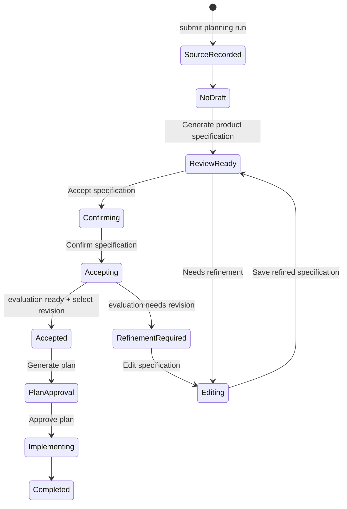

# Specification evaluation lifecycle

This guide explains the product-specification gate: which API call is expected
next, what Cogito persists, and what the Workbench should show. The workflow
does not automatically move from a generated specification to implementation.
Each gate needs durable evidence and, where marked, an authenticated operator
action.

## Lifecycle



`Confirming` and `Accepting` are transient UI states. The durable acceptance
command validates and selects the exact displayed revision as one idempotent
transition. A failed evaluation persists evidence but never selects that
revision; the operator returns to editing. An explicit waiver remains an
exceptional, separately explained API action rather than an accept outcome.

The product specification is a model-generated, source-provenanced proposal,
not boilerplate. The planner infers fields such as requirements, actors,
assumptions, risks, and journeys from the recorded source. The operator is
accountable for reviewing, correcting, and accepting the resulting contract.

The Workbench presents only these normal review actions:

| Control | Purpose |
| --- | --- |
| **Accept specification** | Opens confirmation; validation and promotion happen only after confirmation. |
| **Needs refinement** | Opens the editor; saving creates a new immutable revision for review. |
| **Confirm specification** | The dialog primary action. |
| **Continue editing** | Leaves confirmation and opens the editor without changing the run. |

The confirmation dialog description is: “Cogito will validate this revision
and, if it is ready, lock it as the input to planning. You can continue editing
instead.” The separate evaluate and select mechanics remain server-side and
are intentionally not normal Workbench controls.

`waived` is an explicit approver exception, not an evaluator outcome. It is
available only through the digest-bound waiver endpoint, requires a rationale
and idempotency key, and is recorded separately from the immutable evaluation.

## Operator states and evidence

| Stage | Operator action | Backend effect | Expected Workbench state |
| --- | --- | --- | --- |
| Source | Submit a run | Store a digest-bound source artifact and planning record | `Specification: completed` |
| Product specification | Generate draft | LiteLLM returns v2 contract; API stores immutable revision | `Product specification: awaiting_operator` |
| Acceptance | Confirm the displayed draft | Deterministically evaluate then select the same digest only if it is `ready` | `completed` when accepted; otherwise `needs_revision` |
| Revision | Submit corrected specification | Store new revision; clear old selection/evaluation pointers | `Product specification: awaiting_operator` |
| Planning | Generate plan | Validate requirement-to-phase coverage; store immutable plan | `Planning: completed`; then `Plan approval: awaiting_operator` |
| Plan approval | Approve/reject/request revision | Persist durable decision and outbox message to Temporal | Gate reflects the decision |
| Implementation | Worker executes approved plan only | Create workspace/job and implementation evidence | `in_progress`, then terminal state |

The run's broad status can stay `planning` while it is stopped at a gate. The
stage projection is the operator instruction: `Planning: needs_revision` means
no planner or worker is executing and a specification revision is required.

## Workbench integration

The Workbench now provides a centralized workflow-specification workspace for
the whole run rather than duplicating a dossier in every stage. It places the
current phase, source and product-specification artifact references (including
their SHA-256 digests), the editable product-specification JSON, workflow
actions, and the durable workflow audit activity in one operator form.

The workspace renders only the current source and product-specification
references; it does not treat browser content as evidence authority. Existing
detail routes retain the full immutable-evidence viewer for other artifact
kinds, including evaluation and plan evidence. A product-specification edit
creates a new immutable revision; acceptance is confirmed separately. If the
authoritative run refreshes to a newer revision while an edit is open,
Workbench preserves the draft as stale and requires an explicit reload before
it can be submitted.

The green **Approve**, blue **Needs refinement**, and red **Cancel** actions
are available in that same workspace when the current gate permits them.
Refinement and cancellation collect a durable rationale. They remain
digest-bound API actions; Workbench does not advance a stage locally. The
server-owned projection remains authoritative at:

```text
GET /api/v1/workbench/runs/{run_id}
```

The companion [Workbench evaluation lifecycle PR](https://github.com/crmagz/workbench/pull/16)
introduced the allow-listed relay and immutable evaluation flow. The
[centralized workflow workspace PR](https://github.com/crmagz/workbench/pull/17)
completes the operator surface while retaining that contract.

## Local Kind validation commands

Use the API directly for mutations and the Workbench relay for read-only
inspection. The commands require `kubectl`, `curl`, and `jq`.

### 1. Start forwards and authenticate

In separate terminals:

```sh
kubectl --context kind-cogito-observability -n cogito \
  port-forward service/cogito-api 8000:8000
```

```sh
kubectl --context kind-cogito-observability -n cogito \
  port-forward service/cogito-workbench-workbench 8080:80
```

In the terminal used for the remaining commands:

```sh
export COGITO_AUTH_TOKEN="$(
  kubectl --context kind-cogito-observability -n cogito \
    get secret cogito-operator-auth \
    -o jsonpath='{.data.token}' | base64 --decode
)"
```

### 2. Create a new run from a branch commit

Cogito pins an immutable commit, not a mutable branch name. Resolve the branch
to a commit before submitting it:

```sh
export GIT_URL="https://github.com/crmagz/cogito-kind-e2e-fixture.git"
export COMMIT_SHA="$(git ls-remote "$GIT_URL" refs/heads/main | awk '{print $1}')"
export SPEC_REF="$(./.claude/scripts/kind-e2e-spec-fixture.sh)"
```

Create the run and retain its ID:

```sh
RUN_ID="$(
  jq -n \
    --arg spec "$SPEC_REF" \
    --arg target "$GIT_URL#$COMMIT_SHA" \
    '{
      initial_specification: "Create exactly one phase that creates .cogito-e2e-marker containing phase-13. Verify only with test -f .cogito-e2e-marker.",
      target_repos: [$target],
      spec_set: $spec,
      constraints: {
        max_wall_clock_minutes: 8,
        max_cost_usd: 3,
        max_review_rounds: 1,
        max_turns_per_phase: 50,
        backup_reserve_turns: 20
      },
      priority: "normal"
    }' |
  curl --fail-with-body --silent --show-error \
    --request POST "http://127.0.0.1:8000/api/v1/planning-runs" \
    --header "Authorization: Bearer $COGITO_AUTH_TOKEN" \
    --header "Content-Type: application/json" \
    --data-binary @- |
  jq -r '.run_id'
)"

printf 'run: %s\n' "$RUN_ID"
```

Expected: HTTP `202`, a new run ID, and one immutable source artifact.

### 3. Generate and accept the specification

```sh
curl --fail-with-body --silent --show-error \
  --request POST "http://127.0.0.1:8000/api/v1/planning-runs/$RUN_ID/generate-product-specification" \
  --header "Authorization: Bearer $COGITO_AUTH_TOKEN" \
  --header "Content-Type: application/json" \
  --data '{}' | jq
```

Expected: HTTP `200`, `product_specification_revision: 1`, and a
content-addressed specification artifact. Repeating the request returns the
same canonical draft.

```sh
SPECIFICATION_JSON="$(
  curl --fail-with-body --silent --show-error \
    "http://127.0.0.1:8000/api/v1/workbench/runs/$RUN_ID" |
  jq
)"

curl --fail-with-body --silent --show-error \
  --request POST "http://127.0.0.1:8000/api/v1/planning-runs/$RUN_ID/accept-product-specification" \
  --header "Authorization: Bearer $COGITO_AUTH_TOKEN" \
  --header "Content-Type: application/json" \
  --header "Idempotency-Key: accept-$RUN_ID" \
  --data "$(jq -n --argjson specification "$SPECIFICATION_JSON" '{
    revision: $specification.product_specification_revision,
    artifact_sha256: ($specification.artifacts[] | select(.kind == "product_specification") | .sha256)
  }')" | jq
```

Expected: HTTP `200` and an `outcome` of `accepted` or `needs_refinement`.
The command persists an evaluation for the displayed digest; only `accepted`
selects it for planning.

### 4. Track the state and inspect evidence

```sh
curl --fail-with-body --silent --show-error \
  "http://127.0.0.1:8080/api/cogito/api/v1/workbench/runs/$RUN_ID" |
  jq '.stages'
```

Read the immutable evaluation evidence:

```sh
EVALUATION_SHA="$(
  curl --fail-with-body --silent --show-error \
    "http://127.0.0.1:8080/api/cogito/api/v1/workbench/runs/$RUN_ID" |
  jq -r '.artifacts[] | select(.kind == "specification_evaluation") | .sha256'
)"

curl --fail-with-body --silent --show-error \
  "http://127.0.0.1:8000/api/v1/workbench/runs/$RUN_ID/evidence/specification_evaluation?artifact_sha256=$EVALUATION_SHA" \
  --header "Authorization: Bearer $COGITO_AUTH_TOKEN" | jq
```

For `needs_revision`, use `findings` and `required_decisions` to produce a
new specification revision. First retrieve the current immutable JSON, edit
the decisions in a local copy, then submit that complete replacement:

```sh
SPECIFICATION_SHA="$(
  curl --fail-with-body --silent --show-error \
    "http://127.0.0.1:8080/api/cogito/api/v1/workbench/runs/$RUN_ID" |
  jq -r '.artifacts[] | select(.kind == "product_specification") | .sha256'
)"

curl --fail-with-body --silent --show-error \
  "http://127.0.0.1:8000/api/v1/workbench/runs/$RUN_ID/evidence/product_specification?artifact_sha256=$SPECIFICATION_SHA" \
  --header "Authorization: Bearer $COGITO_AUTH_TOKEN" |
  jq -r '.content' > revised-specification.json
```

Resolve each question/assumption in `revised-specification.json`; preserve the
typed structure, stable IDs, and source provenance. Then submit it:

```sh
curl --fail-with-body --silent --show-error \
  --request POST "http://127.0.0.1:8000/api/v1/planning-runs/$RUN_ID/revise-product-specification" \
  --header "Authorization: Bearer $COGITO_AUTH_TOKEN" \
  --header "Content-Type: application/json" \
  --header "Idempotency-Key: revise-$RUN_ID-1" \
  --data "$(jq -n \
    --arg parent "$SPECIFICATION_SHA" \
    --slurpfile specification revised-specification.json \
    '{
      expected_product_specification_revision: 1,
      parent_artifact_sha256: $parent,
      specification: $specification[0]
    }')" | jq
```

Use the accept command again after saving the resulting revision. Do not generate
a plan while it remains `needs_revision`. Expected stage sequence:

```text
Specification: completed
Product specification: needs_revision
Specification evaluation: needs_revision
Planning: needs_revision
```

After an `accepted` outcome, generate a plan:

```sh
curl --fail-with-body --silent --show-error \
  --request POST "http://127.0.0.1:8000/api/v1/planning-runs/$RUN_ID/generate-plan" \
  --header "Authorization: Bearer $COGITO_AUTH_TOKEN" \
  --header "Content-Type: application/json" \
  --data '{}' | jq
```

Without a selected specification and matching ready evaluation, this returns
HTTP `409`. A valid plan must carry the selected specification/evaluation
digests and cover every approved requirement exactly once.

### 5. Inspect and approve a generated plan

After successful plan generation, confirm the durable plan evidence and the
approval gate:

```sh
PLAN_SHA="$(
  curl --fail-with-body --silent --show-error \
    "http://127.0.0.1:8080/api/cogito/api/v1/workbench/runs/$RUN_ID" |
  jq -r '.artifacts[] | select(.kind == "plan") | .sha256'
)"

curl --fail-with-body --silent --show-error \
  "http://127.0.0.1:8000/api/v1/workbench/runs/$RUN_ID/evidence/plan?artifact_sha256=$PLAN_SHA" \
  --header "Authorization: Bearer $COGITO_AUTH_TOKEN" | jq

curl --fail-with-body --silent --show-error \
  "http://127.0.0.1:8000/api/v1/planning-runs/$RUN_ID/coordination" \
  --header "Authorization: Bearer $COGITO_AUTH_TOKEN" | jq
```

Only after reviewing the plan should an approver send this command. It is the
step that permits real worker execution, so it is intentionally not part of a
read-only validation:

```sh
curl --fail-with-body --silent --show-error \
  --request POST "http://127.0.0.1:8000/api/v1/coordination/runs/$RUN_ID/actions/plan" \
  --header "Authorization: Bearer $COGITO_AUTH_TOKEN" \
  --header "Content-Type: application/json" \
  --header "Idempotency-Key: approve-$RUN_ID" \
  --data "$(jq -n --arg digest "$PLAN_SHA" '{
    decision: "approve",
    artifact_sha256: $digest
  }')" | jq
```

Expected: the durable coordination record advances from the plan gate, the
outbox delivers the decision to Temporal, and Workbench eventually shows
implementation activity. A rejected or revision-requested decision keeps
execution blocked.

## Backend audit trail

Cogito keeps evidence instead of relying on browser state:

- Source, product specification, evaluation, and plan JSON are content
  addressed in object storage and SHA-256 verified before reuse.
- The planning-run record carries the selected specification/evaluation
  pointers; a new specification revision clears them.
- The evaluator stores exact specification revision and digest provenance.
- Plan generation re-reads selected immutable artifacts and validates
  requirement traceability before storing a plan.
- Approval decisions are immutable/outbox-backed; Temporal cannot execute an
  unapproved plan.

Use the Workbench projection and evidence routes for review. Do not inspect
object-store paths directly or copy credentials into a browser.
